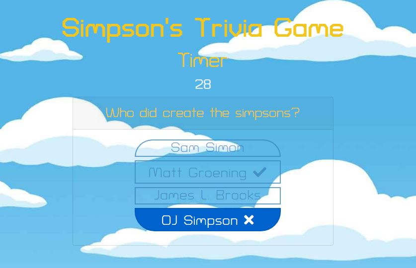

# Simpsons Trivia Game

## Overview 

* Trivia game that shows one question until the player answers or the timer runs out.
* If the player selects the correct answer, show a screen congratulating and reproduce a sound for choosing the right option. After a few seconds, displays the next question
* The scenario is similar for wrong answers and time-outs, for any wrong answer or timeout the app will display the right answer.
* On the final screen, the number of correct answers, incorrect answers, and an option to restart the game is displayed

  

## Technologies used to develop the app
- HTML5
- CSS3
- Bootstrap
- Javascript
- JQuery

## App Link
https://jfsilvah.github.io/TriviaGameAdvanced/index.html

## Author
ISC Francisco Silva
